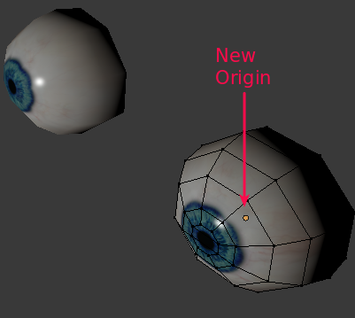

# MH Community 

This is a blender plugin which brings features related to MakeHuman.  It provides for post import operations specific to MakeHuman meshes, and armatures.

# Mesh based Operations

## Sync mesh

##Separate Eyes & Center origins around mass
|Eye Mesh Before| Eye Meshes After|
| --- | --- 
||

The single Eye mesh as it comes out of MakeHuman is only really adjustable while using the Default (163 bones) or Default No Toes (137 bones) armatures.  In downstream systems this is way too many for some.  Android & iOS for example can barely manage around 23 using WebGL 1.0.

There is another way to move them by just separating each eye, and assigning the same rotation.  Most gaming frameworks, including 'Blender Game', also have a feature called billboard mode.  When switched on, the framework ensures that a mesh is always facing the camera.  This allows for the effect of making the eyes follow the camera with very little work.

It was observed that eyes also needed to be setback a minor amount to keep from violating the skin when rotation was large (15% eye depth for billboard mode & 10% for manual setting).  This is not really noticable, however piercing the skin most definitely is. 

If managing the setting outside of billboard mode, staying between -0.12 and 0.12 radians seem to be the practical limits.  Left & right limits vary by eye.

||Rotate Left| Rotate Right|
|Left Eye|-0.50|0.35|
|Right Eye|-0.35|0.50|

# Armature Operations

## Sync pose

## IK

