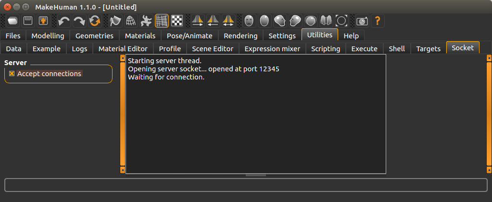
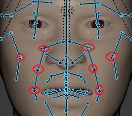
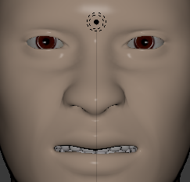
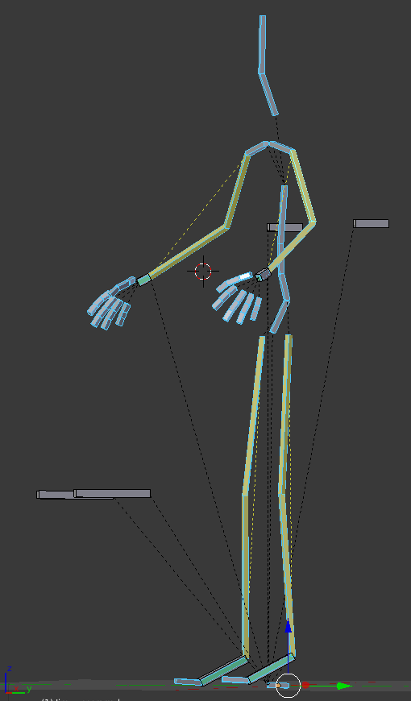
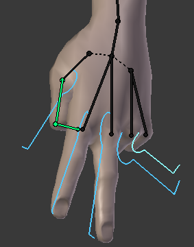
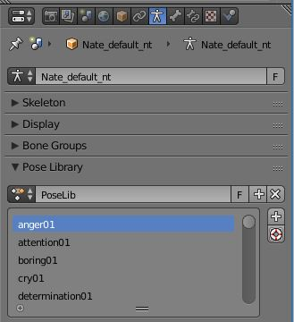

# MH Community Plug-in for Blender #

This is a blender plug-in which brings features related to MakeHuman.  It provides for post import operations specific to MakeHuman meshes, and armatures.  Sync operations require that MakeHuman be running, with server connections being accepted.

# Mesh based Operations #

## Sync mesh ##

## Separate Eyes & Center origins around mass ##
|Eye Mesh Before| Eye Meshes After|
| --- | ---
||

The single Eye mesh as it comes out of MakeHuman is only really adjustable while using the Default (163 bones) or Default No Toes (137 bones) armatures.  This is way too many Bones for some downstream systems.  Android & iOS for example can barely manage around 23 bones using WebGL 1.0.

There is another way to move them by just separating each eye, and assigning the same rotation.  Most gaming frameworks, including 'Blender Game', also have a feature called billboard mode.  When switched on, the framework ensures that a mesh is always facing the camera.  This allows for the effect of making the eyes follow the camera with very little work.

It was observed that eyes also needed to be setback a minor amount to keep from violating the skin when rotation was large (15% eye depth for billboard mode & 10% for manual setting).  This is not really noticable, however piercing the skin most definitely is.

If managing the rotation outside of billboard mode, staying between -0.12 and 0.12 radians seem to be the practical vertical limits.  Left & right limits vary by eye.

|Eye|Rotate Left| Rotate Right|
| --- | --- | --- |
|Left|-0.50|0.35|
|Right|-0.35|0.50|

# Armature Operations #

## Sync pose ##
In addition to MakeHuman running & accepting socket connections, the current model must have the Default, or Default No Toes skeleton selected.  The skeleton running in Blender must match.  If possible, you should use the same MH model that was used to do the export.  The current pose and expression are transferred to Blender.  If feet were exported on the ground, check the `Feet on Ground` check just below.  This will clear the location on the `root` bone.  Many of the poses have location changes to root, so either way some pose adjustment will be required.  Expression transfers will all work fine, though.

Many expressions, e.g. Anger01, have location translation on locked bones.  To allow this translation to occur ensure the `No Location Translation` checkbox remains unchecked.  Allowing translation will result in poses which more closely resemble those in MakeHuman.  There is one side effect, though.  Clearing locations for these bones, Alt-G, will not work.  Syncing again when MakeHuman's expression is set to `None` is one way to restore Alt-G.

|Make Human| With Trans| Without Trans |
| --- | --- | --- |
|||  

## Convert to IK Rig ##
|Before|After
| --- | ---
||
This operator converts the Game Rig post export to a IK capable one.  This is done by:
- Adding IK bones on elbows, wrists, knees, and ankles.
- Adding IK constraints on bones to allow these IK bones to be used to pose.
- Unlocking the pose location of the pelvis & clavicle bones.

This operation will work for models imported using MHX2 or Collada, from a bone naming stand point, but issues resulting from importing bones using Collada still remain.

## Add Finger IK Bones ##

|Finger Rig (shown with GZM_Knuckle custom shape on Default Rig)|
| --- 
|

Finger control bones are added with this operation.  This works for both the Default Rig, and Game Rig.  Finger bones under control are hidden to avoid confusion, except for the thumb.  If you ever need to see them again, then go to edit mode where all bones are shown.  Select the bone to unhide, then return to pose mode.  You can now unhide it.

If there is a mesh named GZM_Knuckle in the scene, it will be assigned as the custom shape.

## Remove Finger Bones ##
This operation removes all bones below the wrists.  Any bone weights which were held by the deleted bones are transferred to the wrists, based on vertex groups.  Not a major task, but saves the tedious task of weight painting manually.

# Expression Transfer #
|New Library|Active Library
| --- | ---
||

This feature lets you move expressions to Blender, both stock and your custom expressions, without them being put on the export file (actually custom expressions are never on the export).  Having the results being stored in a Pose Library also allows you to set to any of them whenever you wish, without using the MHX2 user interface, or requiring specific MHX2 overrides during import.  This is specifically tested without overriding an MHX2 import at all.  Collada format will also work assuming the skeleton imports correctly.

Behind the scenes `Sync pose` is being called in a loop, so the same setup described above also applies here.  Also, an active Pose Library must be present, in addition to the skeleton being selected, to allow the `To Poselib` button to be enabled.

One quirk to creating a Pose Library, if you need to, is the `Pose` element in the Outliner must be selected for the `New` button to be enabled.

You can also specify an expression tag to filter by just like in MakeHuman. This has been not case sensitive.